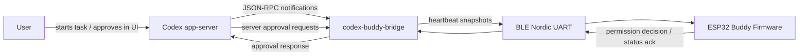

# Codex Buddy Port Plan

Date: 2026-04-24

## Goal

Create a usable Codex hardware buddy based on Anthropic's Claude Desktop Buddy
reference project.

The target experience is:

- A small ESP32/M5StickC-style desk device shows Codex activity.
- It wakes for active turns, highlights approval prompts, and shows recent
  activity.
- It can send an approve/deny decision back to Codex when that is safe and
  explicitly enabled.
- Character packs and the basic pet behavior remain compatible with the
  upstream hardware design where practical.

## Current Findings

### Local workspace

- `/Users/dylanmccavitt/codex-buddy` is currently empty.
- `git status` fails because the directory is not initialized as a git repo.
- The global workflow kit exists at `~/.agent-workflow-kit/README.md`, but the
  one-issue/one-worktree/one-branch/one-PR rule cannot be applied mechanically
  until this directory is a real git repository.

### Upstream Claude project

The upstream project is a reference firmware, not a general desktop bridge.
Important source facts:

- Firmware target: ESP32 with Arduino framework and PlatformIO.
- Board/library target: `m5stack/M5StickCPlus`.
- BLE transport: Nordic UART Service.
- Wire format: newline-delimited UTF-8 JSON.
- Key firmware modules:
  - `src/main.cpp`: loop, state machine, UI screens, prompt buttons.
  - `src/ble_bridge.cpp`: BLE NUS peripheral, secure pairing, RX/TX chunking.
  - `src/data.h`: heartbeat JSON parsing and prompt state.
  - `src/xfer.h`: character folder push receiver.
  - `src/stats.h`: NVS-backed stats, owner, settings, species.
  - `src/character.cpp`: GIF/text character rendering.
  - `src/buddy.cpp` and `src/buddies/*`: built-in ASCII pets.
- Upstream advertises device names like `Claude-XXXX` because Claude Desktop's
  device picker filters for that prefix.
- Upstream license is MIT for code, with separate third-party rights for the
  bundled `characters/bufo` GIF artwork.

### Codex integration surface

Codex does not appear to have a Claude-style built-in hardware buddy BLE
window. The usable integration surfaces are:

- `codex app-server`: JSON-RPC transport used by rich Codex clients. It streams
  thread, turn, item, command, tool, message, token, and approval events.
- App-server approvals: Codex sends server-initiated JSON-RPC approval requests
  for command execution and file changes; the client responds with a decision.
- Hooks: Codex has work-in-progress hooks, including `PermissionRequest`, which
  can approve or deny approval prompts before the normal UI prompt is shown.
- `notify`: config accepts a command that receives a JSON payload from Codex, but
  this is too coarse for the main bridge.

The app-server bridge is the clean MVP path. Hooks can become an adapter for
existing Codex Desktop/CLI sessions later.

Sources:

- Upstream repo README and project layout:
  https://github.com/anthropics/claude-desktop-buddy
- Upstream protocol reference:
  https://github.com/anthropics/claude-desktop-buddy/blob/main/REFERENCE.md
- Codex app-server docs:
  https://developers.openai.com/codex/app-server
- Codex hooks docs:
  https://developers.openai.com/codex/hooks
- Codex config reference for `notify`:
  https://developers.openai.com/codex/config-reference

## Proposed Architecture



### Firmware

Base the initial firmware on upstream with narrow changes:

- Rename product strings from Claude to Codex.
- Advertise as `Codex-XXXX`, while allowing the bridge to discover both
  `Codex-*` and `Claude-*` during transition.
- Keep Nordic UART UUIDs unchanged.
- Keep the snapshot/status/folder-push transport mostly unchanged.
- Add explicit Codex decision aliases while preserving upstream aliases:
  - `once` -> Codex `accept`
  - `deny` -> Codex `decline`
  - optional future: `acceptForSession`, `cancel`
- Show approval prompt type in the small display where possible:
  - command execution
  - file change
  - network permission
  - generic permission request

### Desktop Bridge

MVP bridge stack:

- Python 3.11+.
- `bleak` for cross-platform BLE central support.
- `asyncio` subprocess for `codex app-server` stdio JSON-RPC.
- Generated local app-server schema artifacts for the installed Codex version.
- A small policy engine that decides which Codex approval prompts may be sent to
  the hardware for direct response.

Why Python first:

- It can spawn and drive app-server over JSONL without Electron or native UI.
- It can use `bleak` on macOS/Windows/Linux.
- It matches the upstream repo's existing Python tooling style.
- A Swift menubar/CoreBluetooth bridge can come later if packaging becomes the
  limiting factor.

### Bridge Modes

1. App-server mode, primary MVP:
   - Bridge starts or connects to `codex app-server`.
   - Bridge owns the Codex thread/turn lifecycle.
   - Full event stream is available.
   - Hardware decisions can answer app-server approval requests.

2. Hooks mode, later compatibility:
   - Bridge daemon runs independently.
   - Codex hooks call a local bridge endpoint during `PermissionRequest`,
     `Stop`, and possibly `PostToolUse`.
   - Works better with existing Codex Desktop/CLI sessions.
   - Lower fidelity: lifecycle and prompt events are available, but full streamed
     transcript/token state may be incomplete.

## Wire Protocol Mapping

Use the upstream heartbeat shape as the device-facing contract:

```json
{
  "total": 1,
  "running": 1,
  "waiting": 0,
  "msg": "running: tests",
  "entries": ["12:03 command: npm test", "12:02 editing files"],
  "tokens": 12400,
  "tokens_today": 12400
}
```

When Codex is waiting for approval:

```json
{
  "total": 1,
  "running": 0,
  "waiting": 1,
  "msg": "approve: Bash",
  "prompt": {
    "id": "serverRequest:42",
    "kind": "command",
    "tool": "Bash",
    "hint": "npm test"
  }
}
```

Device to bridge:

```json
{"cmd":"permission","id":"serverRequest:42","decision":"accept"}
{"cmd":"permission","id":"serverRequest:42","decision":"decline"}
```

Compatibility aliases:

- `decision:"once"` is accepted as `accept`.
- `decision:"deny"` is accepted as `decline`.

Status and character transfer stay close to upstream:

- `{"cmd":"status"}`
- `{"cmd":"name","name":"Buddy"}`
- `{"cmd":"owner","name":"Dylan"}`
- `{"cmd":"unpair"}`
- `char_begin`, `file`, `chunk`, `file_end`, `char_end`

## Safety Model

Approving Codex work from a tiny hardware screen is riskier than approving from
the desktop UI because the command, file diff, or network request may be too
large to inspect.

Default policy:

- Hardware approval is disabled until the user enables it in bridge config.
- Hardware can always display that Codex is waiting.
- Hardware can always deny/cancel a pending approval.
- Hardware approve is allowed only for prompts that pass a local policy check.
- High-risk prompts must be approved in the Codex UI, not on-device.

Initial allow-list candidates:

- Read-only commands such as `ls`, `pwd`, `rg`, `cat`, `sed`, `git status`,
  `git diff`, and test commands configured by the user.
- File changes only when the changed paths and summary fit on the device and
  the bridge policy explicitly allows file-change approval.
- Network approvals only for configured hosts.

The bridge should log each hardware decision locally with:

- timestamp
- prompt id hash or safe id
- prompt kind
- decision
- allow/reject outcome
- reason

The decision log must not include raw prompt text, full command strings, file
paths, transcript text, or approval details.

## Implementation Roadmap

### Milestone 0: Repository setup

Deliverables:

- Initialize git.
- Add workflow docs/templates from the global workflow kit.
- Add upstream source attribution and license notes.
- Decide whether to vendor, fork, or subtree the upstream firmware.

Verification:

- `git status --short --branch`
- workflow kit repository check once bootstrapped

### Milestone 1: Firmware baseline import

Scope:

- Import upstream firmware code with MIT attribution.
- Keep it building before semantic changes.
- Do not change hardware behavior beyond repository integration.

Acceptance criteria:

- `pio run` succeeds for the M5StickC Plus environment.
- README documents flashing and erase commands.
- Upstream license is retained.
- Bufo asset licensing is either preserved clearly or the asset is excluded.

Non-goals:

- Codex bridge integration.
- UI redesign.
- New board support.

Verification commands:

- `pio run`
- `pio run -t upload` on hardware

### Milestone 2: Codex firmware rebrand and protocol aliases

Scope:

- Rename on-device user-facing strings from Claude to Codex.
- Change advertisement prefix to `Codex-`.
- Add Codex decision aliases while retaining upstream aliases.
- Add small prompt kind labels.

Acceptance criteria:

- Device advertises as `Codex-XXXX`.
- Device still accepts heartbeat/status/folder-push JSON.
- Device sends valid permission decision JSON.
- Existing serial test tooling still works after fixture updates.

Verification commands:

- `pio run`
- `python3 tools/test_serial.py`
- manual nRF Connect discovery for `Codex-*`

### Milestone 3: Bridge proof of concept

Scope:

- Build `codex-buddy-bridge` that starts `codex app-server`.
- Generate app-server schemas for the local Codex version.
- Connect to the buddy over BLE NUS.
- Send time sync, owner/name command, status poll, and heartbeat snapshots.
- Map basic Codex turn lifecycle to `idle`, `busy`, `attention`, and
  `celebrate`.

Acceptance criteria:

- Bridge can discover and connect to `Codex-*`.
- Device shows connected state when app-server is active.
- Device shows busy while a Codex turn is running.
- Device returns to idle when the turn completes.

Non-goals:

- Hardware approval.
- Character folder push UI.
- Packaged desktop app.

Verification commands:

- `python3 -m codex_buddy_bridge --dry-run`
- `python3 -m codex_buddy_bridge --device Codex-*`
- `pytest`

### Milestone 4: Approval request round trip

Scope:

- Convert app-server approval requests into device `prompt`.
- Accept device `permission` decisions.
- Apply safety policy before responding to Codex.
- Deny/cancel from hardware should always work for active prompts.
- Approve from hardware only works when policy allows it.

Acceptance criteria:

- A Codex command approval appears on the device.
- Device A approves only policy-allowed prompts.
- Device B declines the prompt.
- Bridge refuses high-risk hardware approvals and leaves the Codex UI prompt
  pending.
- All decisions are logged locally.

Verification commands:

- `pytest`
- integration test with fake app-server request stream
- manual Codex approval prompt with a harmless allow-listed command
- manual high-risk prompt that must not be approvable from hardware

### Milestone 5: Character transfer and UX polish

Scope:

- Reuse upstream folder push protocol from bridge to device.
- Provide CLI commands to install character packs.
- Update docs for character pack format.
- Add bridge status output and troubleshooting.

Acceptance criteria:

- `codex-buddy character install characters/bufo` streams a pack over BLE.
- Device shows install progress and switches to GIF mode.
- Invalid paths and oversized packs are rejected.

Verification commands:

- `pytest`
- `python3 -m codex_buddy_bridge.character install characters/bufo`

### Milestone 6: Existing Codex session adapter

Scope:

- Add optional hooks-mode adapter for regular Codex Desktop/CLI sessions.
- Provide config snippets for `PermissionRequest` and lifecycle hooks.
- Hook scripts communicate with the bridge daemon over localhost or Unix socket.

Acceptance criteria:

- A normal Codex session can show approval waiting on the device.
- Hook-mediated deny works.
- Hook-mediated approve follows the same safety policy.

Non-goals:

- Relying on unstable private Codex internals.
- Reading arbitrary Codex logs or telemetry without explicit user opt-in.

Verification commands:

- hook unit tests with fixture payloads
- manual Codex session requiring shell approval

## Open Questions

- Confirm exact hardware: M5StickC Plus, M5StickC Plus2, or a different ESP32
  board with display/buttons.
- Decide whether the first bridge should own the Codex session via app-server or
  prioritize hooks for existing Codex Desktop sessions.
- Decide whether hardware approve should ever support file changes, or only
  command approvals.
- Decide whether to preserve upstream built-in ASCII pets exactly or replace the
  Claude-flavored UI copy first.
- Decide packaging target: developer CLI only, macOS LaunchAgent, or menubar app.

## Recommended Next Step

Initialize the repo and create the first issue packet for Milestone 0. After
that, import the upstream firmware unchanged and verify it builds before making
Codex-specific edits.
